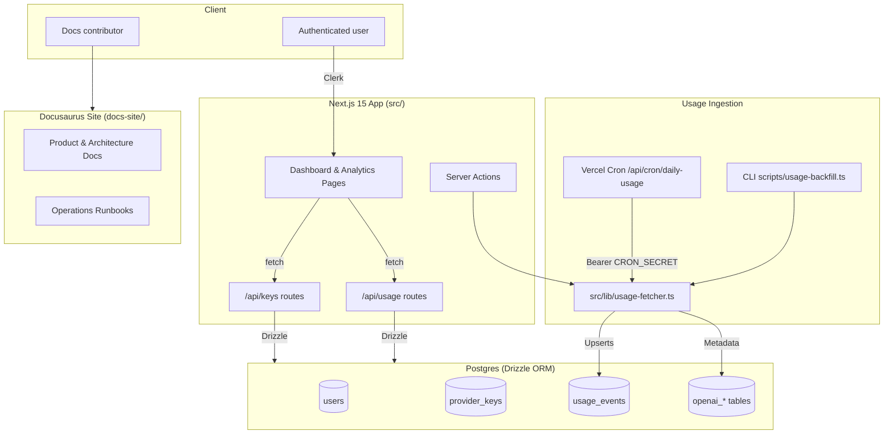

# CogniTrack Architecture

CogniTrack combines a Next.js application, scheduled ingestion workers, and a Postgres datastore to provide day-by-day visibility into LLM usage. This document orients new contributors to the system boundaries, core modules, and configuration surface.

## System Map

## Runtime Components

### Next.js application (`src/app/`)
- `src/app/page.tsx`: marketing-style landing page that drives sign-in/sign-up via Clerk safe wrappers in `src/lib/safe-clerk.tsx`.
- `src/app/dashboard/page.tsx`: authenticated dashboard for managing provider keys (`AddKeyForm.tsx`, `EditKeyForm.tsx`, `KeyCard.tsx`).
- `src/app/analytics/page.tsx`: server-rendered analytics view that hydrates `FilterableAnalyticsDashboard` with aggregated usage metadata.
- `src/middleware.ts`: wraps protected routes with `clerkMiddleware`, redirecting unauthenticated users.

### API routes & server actions (`src/app/api/`)
- `/api/keys` (`route.ts`): CRUD handlers for encrypted provider keys. Bootstraps tables when running against fresh databases and normalizes stored metadata.
- `/api/usage` (`route.ts`): exposes a POST ingestion trigger and a GET endpoint that streams the latest usage windows (with graceful fallback if metadata columns are missing).
- `/api/cron/daily-usage` (`route.ts`): Vercel-triggered cron job that iterates all users, runs `fetchAndStoreUsageForUser`, and returns aggregated telemetry. Guarded by a timing-safe comparison against `CRON_SECRET`.
- `src/app/analytics/actions.ts`: server action bound to the analytics page’s refresh button, providing a scoped ingestion kick-off without exposing secrets client-side.

### Ingestion & data access (`src/lib/`)
- `database.ts`: selects Neon HTTP or pooled Postgres connections at runtime and memoizes the Drizzle instance.
- `encryption.ts`: AES-256-GCM helpers that decrypt provider keys before outbound API calls.
- `usage-fetcher.ts`: orchestrates window construction, rate limiting, API calls (standard vs admin modes), dedupe upserts, and telemetry. Applies feature flags such as `ENABLE_DAILY_USAGE_WINDOWS`, `ENABLE_SIMULATED_USAGE`, and `ENABLE_USAGE_ADMIN_CONSTRAINT_UPSERT`.
- `usage-event-helpers.ts`: shapes Drizzle selections for analytics queries and normalizes DB rows into `UsageEventWithMetadata`.
- `provider-key-utils.ts`: input normalization for usage modes and timestamps.

### Database layer (`src/db/` + `drizzle/`)
- `schema.ts`: defines normalized tables for users, provider keys, usage events, and OpenAI admin entities (projects, members, service accounts, keys, certificates, cursors).
- `drizzle/*.sql`: migration history capturing schema evolution (`0000` bootstrap tables, `0001` usage modes, `0002` admin objects, `0003` window metadata dedupe index).
- `drizzle.config.ts`: loads connection strings from `.env.local`, prioritising `DRIZZLE_DATABASE_URL` or `LOCAL_DATABASE_URL` during development.

### Documentation assets (`docs-site/`)
- Docusaurus configuration (`docusaurus.config.ts`, `sidebars.ts`) and markdown content under `docs-site/docs/`.
- GitHub Pages deployment pipeline defined in `.github/workflows/docs-deploy.yml`.

## Request & Data Flows

### Usage Analytics
1. Clerk middleware authenticates the request and injects the user ID.
2. `src/app/analytics/page.tsx` queries `usage_events` joined with `provider_keys` using the selection defined in `usage-event-helpers.ts`.
3. Metadata (project, API key, service tier, batch flags) drives filter options inside `FilterableAnalyticsDashboard.tsx`.
4. Users trigger `refreshUsageData` (server action) to call `fetchAndStoreUsageForUser`, receive toast feedback via `RefreshButton.tsx`, and see live updates after a router refresh.

### Provider Key Lifecycle
1. Dashboard forms POST to `/api/keys` with encrypted key material and optional admin metadata.
2. Route handlers encrypt payloads using `encryption.ts`, ensure the owning user exists, and persist to Postgres through Drizzle.
3. Masked keys and usage mode flags feed UI state. Updates to usage mode require admin metadata (organization & project IDs) and propagate to ingestion configuration.

### Scheduled Ingestion
1. Vercel Cron hits `/api/cron/daily-usage` with a bearer token stored in `CRON_SECRET`.
2. The handler validates secrets, loads all registered users, and batches `fetchAndStoreUsageForUser` calls.
3. `fetchAndStoreUsageForUser` (a) decrypts keys, (b) constructs per-day windows (when `ENABLE_DAILY_USAGE_WINDOWS` is true), (c) fetches usage from OpenAI Admin or standard endpoints, (d) upserts windows via a partial unique constraint (`usage_admin_bucket_idx`), and (e) records telemetry counters.
4. Telemetry aggregates (processed keys, windows, constraint inserts/updates, issues by code) return in the response and are archived under `audit/cron-dry-run/`.

### Backfill & Telemetry Diff Tooling
- `scripts/usage-backfill.ts`: CLI supporting chunked historical replays, user-specific filters, and telemetry logs. Useful for staging rehearsals and migrations.
- `scripts/usage-telemetry-diff.ts`: Compares ingested windows against CSV exports to detect variance. Supports optional Neon HTTP connections for direct DB queries.
- `scripts/admin-usage-sample.ts`: Minimal script to validate admin credentials and observe response payloads.

## Configuration & Feature Flags

| Flag / Variable | Purpose | Defined in |
| --- | --- | --- |
| `DATABASE_URL` / `LOCAL_DATABASE_URL` | Database connection strings for production and local contexts. | `.env.local`, `drizzle.config.ts` |
| `NEXT_PUBLIC_CLERK_PUBLISHABLE_KEY`, `CLERK_SECRET_KEY` | Clerk authentication configuration. | `.env.example`, `src/lib/safe-clerk.tsx` |
| `ENCRYPTION_KEY`, `ENCRYPTION_MASTER_KEY` | AES-256-GCM secrets for provider key encryption. | `.env.example`, `src/lib/encryption.ts` |
| `CRON_SECRET` | Bearer credential gating `/api/cron/daily-usage`. | `.env.example`, `src/app/api/cron/daily-usage/route.ts` |
| `OPENAI_USAGE_MODE` | Default ingestion mode (`standard` or `admin`). | `src/lib/usage-fetcher.ts` |
| `OPENAI_ORGANIZATION`, `OPENAI_PROJECT`, `OPENAI_API_KEY` | Required admin credentials and headers. | `src/lib/usage-fetcher.ts`, `scripts/admin-usage-sample.ts` |
| `ENABLE_DAILY_USAGE_WINDOWS` | Enables per-window ingestion and metadata persistence. | `src/lib/usage-fetcher.ts` |
| `ENABLE_USAGE_ADMIN_CONSTRAINT_UPSERT` | Activates constraint-based upserts for admin windows. | `src/lib/usage-fetcher.ts` |
| `ENABLE_SIMULATED_USAGE` | Allows simulated events as fallback when permissions are missing. | `src/lib/usage-fetcher.ts` |
| `OPENAI_ADMIN_REQUESTS_PER_MINUTE`, `OPENAI_ADMIN_MAX_BURST` | Rate limiting parameters for admin ingestion. | `src/lib/usage-fetcher.ts` |

Full environment guidance lives in `docs-site/docs/architecture/environment-configuration.md`.

## Observability & Audit
- Telemetry metrics originate from the `IngestionTelemetry` object (processed keys, simulated failures, constraint inserts, issues) returned by `fetchAndStoreUsageForUser` and cron handlers.
- Run artefacts are stored in `audit/`, including parity diffs, cron dry-run summaries, and rollback notes.
- GitHub workflows (`.github/workflows/docs.yml`, `docs-deploy.yml`) build and validate the documentation site on PRs and main pushes.
- `tests/usageFetcherSecurity.test.ts` validates pagination URL sanitisation; `tests/usageFetcherContract.test.ts` and companions ensure ingestion logic stays compatible with fixtures.

## Security Considerations
- Clerk middleware ensures API routes only run for authenticated users; when Clerk is not configured in local sandboxes, `SafeClerkProvider` gracefully degrades to offline mode.
- Secrets are accessed exclusively via environment variables; example values are never committed and `.env.local` is ignored by Git (`.gitignore`).
- Provider credentials are AES-GCM encrypted per record with IV and auth tag stored alongside ciphertext; metadata uses the same envelope.
- Cron secrets are compared with `timingSafeEqual` to avoid timing attacks and responses omit sensitive values by design.
- Admin ingestion sanitises `next_page` URLs to prevent SSRF and enforces host/path allowlists (`__usageFetcherTestHooks.sanitizeAdminNextPageUrlForTest`).

## Related Documentation
- [Usage Ingestion Pipeline](docs-site/docs/architecture/usage-ingestion-pipeline.md)
- [Telemetry & Observability](docs-site/docs/architecture/telemetry-and-observability.md)
- [Environment Configuration](docs-site/docs/architecture/environment-configuration.md)
- [Daily Usage Cron Runbook](docs-site/docs/operations/daily-usage-cron-runbook.md)
- [Anthropic Integration Roadmap](docs-site/docs/product/anthropic-integration-roadmap.md)

Keep this document updated whenever the architecture evolves (new services, feature flags, or data stores). Cross-reference changes in `memorybank/progress.md` so future contributors can trace design decisions quickly.
