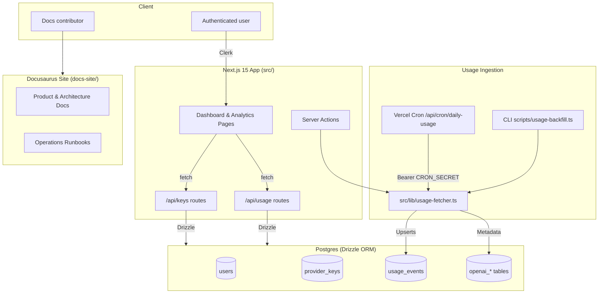

CogniTrack combines a Next.js application, scheduled ingestion workers, and a Postgres datastore to deliver day-by-day visibility into LLM usage. This page expands on the high-level architecture so new contributors can trace how requests flow through the system.

## Runtime Components

### Next.js application (`src/app/`)
- `page.tsx`: marketing-style landing page that surfaces Clerk sign-in/out flows using `SafeClerkProvider`.
- `dashboard/page.tsx`: authenticated workspace for managing provider keys via `AddKeyForm`, `EditKeyForm`, and `KeyCard`.
- `analytics/page.tsx`: renders `FilterableAnalyticsDashboard`, pulling usage metadata with server-side Drizzle queries.
- `middleware.ts`: enforces authentication on `/dashboard`, `/analytics`, and API routes via `clerkMiddleware`.

### API routes & server actions (`src/app/api/`)
- `/api/keys`: CRUD handlers for encrypted provider keys. Bootstraps tables on first run and normalizes org/project metadata.
- `/api/usage`: POST triggers ingestion for the active user; GET streams recent usage windows with metadata, falling back if migrations are missing.
- `/api/cron/daily-usage`: Vercel Cron entrypoint that iterates all users, calls `fetchAndStoreUsageForUser`, and returns telemetry aggregates. Guarded by a timing-safe comparison against `CRON_SECRET`.
- `analytics/actions.ts`: Server action powering the dashboard refresh button without exposing secrets to the client.

### Shared libraries (`src/lib/`)
- `database.ts`: Picks Neon HTTP or pooled Postgres connections and memoizes the Drizzle instance.
- `encryption.ts`: AES-256-GCM helpers for encrypting provider keys and metadata.
- `usage-fetcher.ts`: Core ingestion logic—constructs time windows, enforces admin configuration, manages rate limiting, and upserts usage buckets with telemetry counters.
- `usage-event-helpers.ts`: Shapes Drizzle selections for analytics and normalizes DB rows into typed responses.
- `provider-key-utils.ts`: Validates usage modes and timestamp formatting.

### Data layer
- `src/db/schema.ts`: Defines normalized tables for users, provider keys, usage events, and OpenAI admin entities (projects, members, service accounts, keys, certificates, cursors).
- `drizzle/0000-0003.sql`: Migration history capturing table creation, admin schema expansion, and metadata dedupe index (`usage_admin_bucket_idx`).

### Documentation workspace (`docs-site/`)
- Houses product, architecture, operations, and contributing docs, including the [Usage Ingestion Pipeline](usage-ingestion-pipeline.md) and [Telemetry & Observability](telemetry-and-observability.md).
- GitHub Pages deploys through `.github/workflows/docs-deploy.yml`.

## Request & Data Flows

### Usage Analytics
1. Clerk middleware authenticates requests and injects a user ID.
2. `analytics/page.tsx` queries `usage_events` joined with `provider_keys` using selections defined in `usage-event-helpers.ts`.
3. Metadata (project, API key, service tier) drives filters and charts in `FilterableAnalyticsDashboard`.
4. Refresh actions call `refreshUsageData`, invoking `fetchAndStoreUsageForUser` and updating the UI after telemetry toasts.

### Provider Key Lifecycle
1. Dashboard forms submit to `/api/keys` with encrypted key material.
2. Route handlers encrypt credentials via `encryption.ts`, ensure the `users` table contains the owner, and persist metadata.
3. Admin usage mode requires organization/project IDs; missing configuration surfaces `CONFIGURATION_ERROR` telemetry.

### Scheduled Ingestion
1. Vercel Cron hits `/api/cron/daily-usage` with a valid `CRON_SECRET`.
2. Handler loads all user IDs and sequentially calls `fetchAndStoreUsageForUser`.
3. Ingestion constructs daily windows (when `ENABLE_DAILY_USAGE_WINDOWS` is true), fetches OpenAI admin usage, and upserts via `usage_admin_bucket_idx`.
4. Telemetry tallies processed keys, windows, constraint inserts/updates, manual fallbacks, and issues by code.

### Backfill & Telemetry Diffing
- `scripts/usage-backfill.ts` replays historical windows with chunking, sleep controls, and telemetry logging.
- `scripts/usage-telemetry-diff.ts` compares ingested data against CSV exports to detect variance before rollouts.
- `scripts/admin-usage-sample.ts` offers a quick sanity check for admin credentials.

## Configuration & Feature Flags

| Variable / Flag | Purpose |
| --- | --- |
| `DATABASE_URL` / `LOCAL_DATABASE_URL` | Postgres connection strings (Neon for prod, local for dev). |
| `NEXT_PUBLIC_CLERK_PUBLISHABLE_KEY`, `CLERK_SECRET_KEY` | Clerk authentication configuration. |
| `ENCRYPTION_KEY`, `ENCRYPTION_MASTER_KEY` | AES-256-GCM secrets for credential storage. |
| `CRON_SECRET` | Bearer token that authorizes cron requests. |
| `OPENAI_USAGE_MODE` | Default ingestion mode (`standard` or `admin`). |
| `OPENAI_ORGANIZATION`, `OPENAI_PROJECT`, `OPENAI_API_KEY` | Admin ingestion headers and credentials. |
| `ENABLE_DAILY_USAGE_WINDOWS` | Enables per-window ingestion and metadata persistence. |
| `ENABLE_USAGE_ADMIN_CONSTRAINT_UPSERT` | Switches to constraint-driven upserts once migrations are applied. |
| `ENABLE_SIMULATED_USAGE` | Allows simulated data when permissions are missing (for sandbox testing). |
| `OPENAI_ADMIN_REQUESTS_PER_MINUTE`, `OPENAI_ADMIN_MAX_BURST` | Rate-limit settings for admin ingestion. |

Reference the [Environment Configuration](environment-configuration.md) page for detailed guidance and rotation procedures.

## Security Considerations

- Clerk protects dashboard, analytics, and API routes; `SafeClerkProvider` degrades gracefully in local sandboxes.
- Provider keys remain encrypted at rest, with IV and auth tags stored separately.
- Cron secrets use `timingSafeEqual` to avoid timing attacks.
- Admin pagination sanitises `next_page` URLs to prevent SSRF (`tests/usageFetcherSecurity.test.ts`).
- Telemetry and audit artefacts live under `audit/`, with supporting context captured in `memorybank/`.

Keep this page updated when architecture changes introduce new services, feature flags, or security controls.
