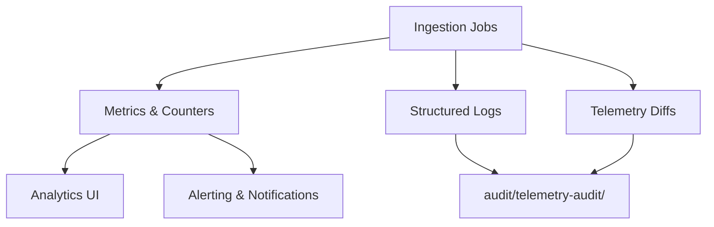

## Overview

Telemetry validates that ingestion jobs run reliably and that dashboards surface
accurate data. This page defines the core metrics, logs, and artefacts that
operators review before enabling or expanding provider integrations.

## Architecture Diagram

## Metrics

- **`ingestion_runs_total`**: Count of ingestion executions by provider and
  outcome (success, retry, failure).
- **`ingestion_windows_missing`**: Number of expected windows absent from the
  latest run. Target is zero prior to beta.
- **`ingestion_duration_seconds`**: Distribution of run durations to track
  performance regressions.
- **`admin_cursor_drift_seconds`**: Difference between the last ingested window
  and current time for admin mode keys.
- **`cost_variance_ratio`**: Comparison of normalized costs vs provider invoices
  during monthly reconciliation.

Metric implementations originate from `IngestionTelemetry` in
[`src/lib/usage-fetcher.ts`](../../../src/lib/usage-fetcher.ts) and supporting
scripts.

## Logs & Audit Artefacts

- **Structured logs** include key identifiers, window ranges, retry counts, and
  sanitized error payloads.
- **Telemetry diffs** generated via
  [`scripts/usage-telemetry-diff.ts`](../../../scripts/usage-telemetry-diff.ts)
  compare ingested data against provider exports. Outputs live under
  [`audit/telemetry-audit/`](../../../audit/telemetry-audit/).
- **Cron rehearsal notes** in [`audit/cron-dry-run/`](../../../audit/cron-dry-run/)
  capture run metadata, operator observations, and rollback confirmations.

## Alerting & Dashboards

- Dashboards visualize processed windows, key health, and variance thresholds
  with accessibility-compliant components.
- Alerts fire when missing window counts exceed tolerance, when run durations
  spike, or when telemetry diffs detect mismatches.
- Operators use fixture-driven contract tests to detect regressions before toggle
  changes.

## Operational Checklists

- Validate telemetry before enabling cron: confirm zero missing windows, no red
  status codes, and parity within tolerance.
- Document each rehearsal (including dry runs and production activations) with
  timestamps, metrics, and outcomes.
- Run monthly cost reconciliation and attach summaries to the audit trail.

## Related Documentation

- [Usage Ingestion Pipeline](./usage-ingestion-pipeline.md)
- [Beta Readiness Tracker](../product/beta-readiness-tracker.md)
- [Anthropic Integration Roadmap](../product/anthropic-integration-roadmap.md)
