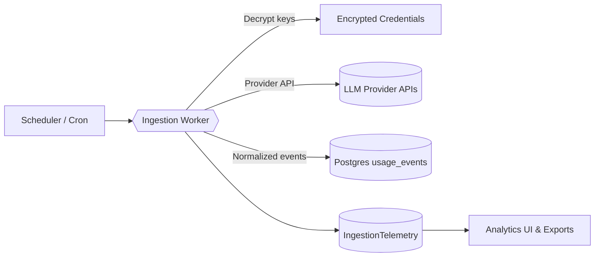

## Overview

The usage ingestion pipeline automates collection of LLM consumption data across
provider modes. Scheduled jobs decrypt stored credentials, call provider admin
APIs, normalize responses, and persist deduplicated usage windows so analytics
and exports stay accurate.

## Architecture Diagram

## Pipeline Stages

### 1. Trigger & Authentication

Vercel Cron (or Inngest) triggers the ingestion worker, which decrypts provider
keys using AES-GCM helpers in [`src/lib/encryption.ts`](../../../src/lib/encryption.ts).
Feature flags determine whether admin mode ingestion is enabled per key.

### 2. Mode Resolution

The worker inspects key metadata to select the correct ingestion mode:

- **Standard mode** calls the provider's per-key usage endpoint.
- **Admin mode** calls organization-wide usage endpoints with additional headers
  (e.g., OpenAI's `OpenAI-Organization` and `OpenAI-Project`).

### 3. Fetch & Normalize

Provider clients fetch usage windows, returning raw events and cost data.
Normalization converts provider-specific fields into a shared schema with token
counts, pricing components, and metadata such as project, user, and service tier
identifiers.

### 4. Deduplicate & Persist

Normalized events persist to Postgres via Drizzle ORM. Inserts rely on the
composite dedupe index (`usage_admin_bucket_idx`) to guarantee idempotency,
falling back to an update when necessary. See
[`src/lib/usage-fetcher.ts`](../../../src/lib/usage-fetcher.ts) for
implementation details.

### 5. Telemetry & Exports

Each run emits structured telemetry consumed by dashboards, APIs, and CSV
exports. Operators review metrics and parity diffs documented in the
`audit/telemetry-audit/` directory before enabling cron jobs.

## Implementation Details

- **Provider abstraction**: Providers implement a shared interface that handles
  fetching, normalization, cost mapping, and dedupe key construction.
- **Backfill tooling**: [`scripts/usage-backfill.ts`](../../../scripts/usage-backfill.ts)
  and related CLI workflows replay historical windows with chunked processing
  and telemetry logging.
- **Fixtures**: Golden fixtures under the `audit/golden-fixtures/` directory
  validate deterministic ingestion outputs and support contract tests.

## Configuration

- Admin mode requires organization and project identifiers plus feature flag
  activation. Reference the [Environment Configuration](./environment-configuration.md)
  for required variables and secrets.
- Shared rate-limiting and retry settings prevent provider throttling
  (`OPENAI_ADMIN_REQUESTS_PER_MINUTE`, burst limits, and retry headers).
- Cron endpoints maintain bearer secrets (e.g., `CRON_SECRET`) to guard
  automation routes.

## Security Considerations

- Provider credentials remain encrypted at rest and are only decrypted in memory
  during ingestion.
- Structured logs redact sensitive fields before forwarding to centralized
  logging.
- Rollback plans cover disabling cron jobs, toggling feature flags, and
  reverting schema changes if ingestion regressions occur.

## Monitoring & Observability

- `IngestionTelemetry` captures processed keys, skipped windows, and error codes
  per provider.
- Telemetry diffs compare staged and expected outputs to confirm data parity
  prior to rollout.
- Alerts trigger when cron runs exceed expected duration or parity thresholds.
  See [Telemetry & Observability](./telemetry-and-observability.md) for metric
  definitions.

## Related Documentation

- [Anthropic Integration Roadmap](../product/anthropic-integration-roadmap.md)
- [Telemetry & Observability](./telemetry-and-observability.md)
- [Environment Configuration](./environment-configuration.md)
